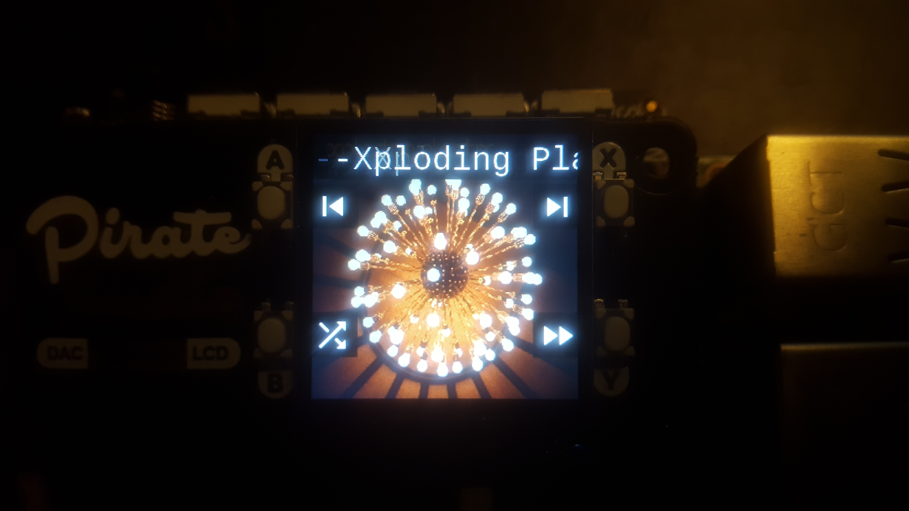

# Raspberry Pi Album Shuffler (radio_star)



## What is it?

Radio Star is a simple media player for the Raspberry Pi. Its purpose is to play full albums at a time, but shuffle the list of albums.

Specifically, this was designed to be a media player for your car. Plug your Pi into a USB port (via cigarette lighter adapter, perhaps) and it plays your albums. No need to get out your phone or use any of that precious data.

Other people have tackled this exact problem with various apps, but this is designed to be a standalone system. At the end of the day, I just had an odd list of requirements, and this fulfills them all.

## Features/Configurations

There are two ways two configure the album shuffler: using the [Pimoroni Button Shim](https://shop.pimoroni.com/products/button-shim) or using the [Pimoroni Pirate Audio DAC/LCD](https://shop.pimoroni.com/products/pirate-audio-line-out).

The button shim simply provides five buttons to control playback and is the more cost effective option.

The DAC/LCD provides four buttons and a display, so you can see what album/song is playing.

## Installation

### General

* Copy the 'radio_star' folder into your Pi's home directory.

* Add the following lines to your crontab.
```
crontab -e
```
```
@reboot python3 /home/pi/radio_star/radio_star.py
```

* Add music to a flash drive/SSD with folders for each artist at the root and folders for each album inside each artist folder.

* [Set your USB storage to auto mount](https://www.raspberrypi.org/forums/viewtopic.php?t=205016)

* Set the location of your music storage device at the top of radio_star.py
```
pathname = "/media/YOUR_DEVICE_NAME"
```

### Button Shim Setup

If you're using the Button Shim, follow these directions.

* Add the button shim listener to your crontab.
```
crontab -e
```
```
@reboot python3 /home/pi/radio_star/shim_listener.py
```

* Install the button shim python library.
```
sudo apt install python3-buttonshim
```

### Pirate Audio Setup

If you're using the Pirate Audio LCD/DAC, follow these directions.

* Add the art fetcher and pirate button listener to your crontab.
```
crontab -e
```
```
@reboot python3 /home/pi/radio_star/art_fetch.py
@reboot python3 /home/pi/radio_star/button_test.py
```

* Install the following dependencies.
```
sudo apt-get update
sudo get install python-rpi.gpio python-spidev python-pip python-pil python-numpy
sudo pip install st7789
```

* Add album art in .jpg or .png format to each album folder. (Easy to do with [mp3Tag](https://community.mp3tag.de/t/how-to-batch-im-export-of-cover-art/3683)). There are some issues with loading art from the metadata, so this is a workaround.

## Usage

The album shuffler will start when your Pi starts up. It takes around 30 seconds from power on to produce audio.

If you're using the button shim, use the far right button to go to the next album, and the button next to it to go to the next song. Use the left-most button the reshuffle your albums, and the button next to it to return to the previous song. The middle button is currently unused, but can be assigned to something in shim_listener.py

If you're using the LCD, you can see the controls on the display itself. Button A goes back one song, button B reshuffles your albums, button X goes forward a song, and button Y goes forward an album.
